# Portfolio "Dienst mit Container anwenden"

Sebastian Christen, INF2022j
2024/02/22, Version 3.1


## Was sind Container?

Ein Container kann man sich am besten so vorstellen, dass er wie eine vereinfachte VM (virtuelle Maschine) ist, welche einen vom Benutzer bestimmten Prozess laufen lässt. Der Container ist dazu da, ein Docker-Image laufen zu lassen, und während der Laufzeit des Containers dieses Image verwendet. Ein Docker-Image, ähnlich wie ein VM-Abbild (Image), beinhaltet gewisse Applikationen, Skripte, etc., welche für den Prozess, den man auf Docker ausführen möchte, benötigt werden. Container eignen sich unter anderem für skalierbare Webapplikationen, welche je nach Auslastung mehr oder weniger Ressourcen benötigen.

## Was ist DevOps?

DevOps steht für Development und Operations, also Entwicklung und Betrieb. DevOps ist etwa im Jahr 2007 entstanden, aus dem Grund, dass Entwickler und IT-Experten besorgt darüber waren, wie traditionelle Softwareentwicklung und IT-Betrieb getrennt voneinander abliefen. DevOps ermöglicht es, die Zusammenarbeit zwischen Entwicklern und IT-Teams zu verbessern und Prozesse zu automatisieren. Ein DevOps-Team besteht aus Entwicklern und IT-Experten, die so lange zusammenarbeiten, solange die entwickelte Applikation verwendet wird.

## Unterschied Virtualisierung und Containerisierung

Der Unterschied zwischen Virtualisierung und Containerisierung ist, wie sie mit der Hardware und dem Betriebssystem umgehen. Bei VMs wird das OS virtuell nachgebildet, was dazu führt, dass VMs ziemlich gross sind. Container benutzen deutlich weniger Ressourcen, da sie sich das Betriebssystem teilen. Deshalb sind Container kleiner und effizienter. Docker läuft nur auf Linux, weil es stark vom Host-Betriebssystem abhängt. Auf Windows benötigt es Windows Subsystem für Linux. Zusammenfassend sind Container viel leichter und auch schneller als VMs.

## Unterschied Image und Container

Container sind wie lauffähige Kopien von Docker-Images. Ein Docker-Image ist wie eine Anleitung für die Software, und der Container ist wie eine aktive Ausführung dieser Anleitung. Container können flexibel und schnell gestartet, gestoppt und verschoben werden, im Gegensatz zu den statischen Docker-Images, die eher wie feste Anleitungen sind.

## Zusammenfassung der wichtigsten Befehle und ihre Funktion (Diese wird laufend ergänzt)

| Befehl                                        | Funktion                                   |
| --------------------------------------------- | ------------------------------------------ |
| `docker image tag <ersterName> <zweiterName>` | Umbenennen                                 |
| `docker login`                                | sich einloggen                             |
| `docker images -a`                            | zeigt alle Images an                       |
| `docker pull <imageName>`                     | lädt das Image imageName herunter          |
| `docker push <tag>`                           | lädt ein Image hoch                        |
| `docker-compose -f docker-compose.yaml up -d` | lädt die Compose-Datei                     |
| `docker system prune --all`                   | löscht nichtbenutze Container, Images etc. |

## Onlyoffice

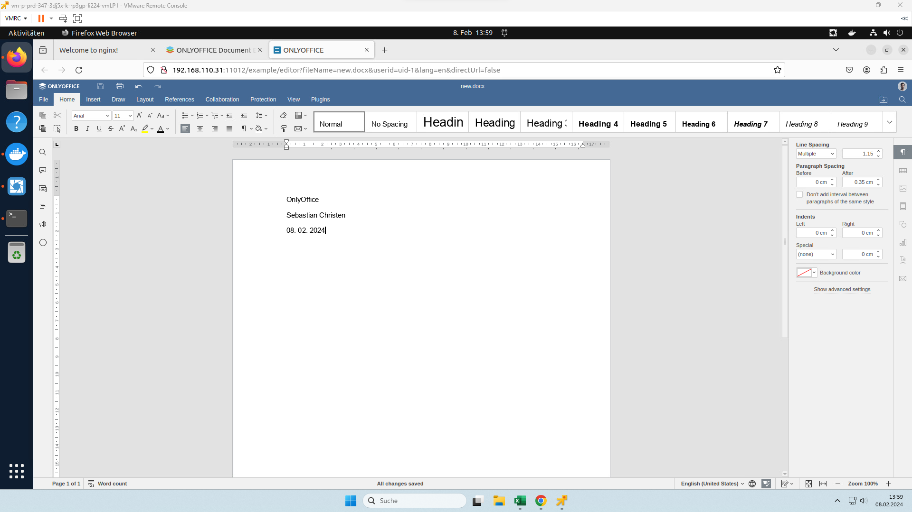

## Todo-app V1

Screenshot des Frontends für Version 1:

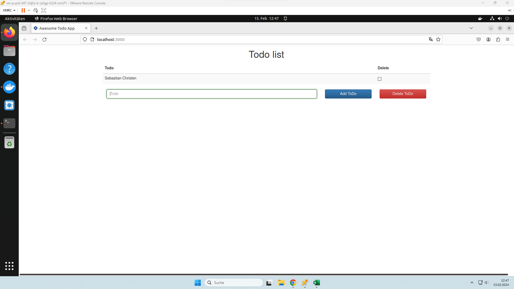

Screenshot der Images auf Git:
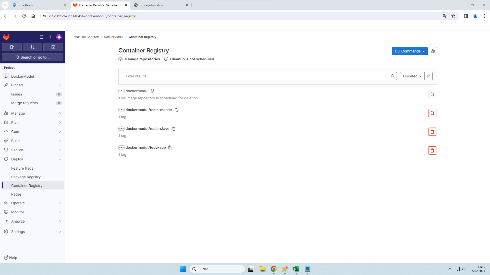

## Aufgabe 1 bei "Ein Image Pushen", Befehle

```bash
docker login git-registry.gibb.ch  # Einloggen
docker image tag todo-app:v1 git-registry.gibb.ch/sch140456/dockermodul/todo-app:v1  # Das Image umbenennen
docker push git-registry.gibb.ch/sch140456/dockermodul/todo-app:v1  # Das Image hochladen

docker image tag redis-slave:v1 git-registry.gibb.ch/sch140456/dockermodul/redis-slave:v1  # Das Image umbenennen
docker push git-registry.gibb.ch/sch140456/dockermodul/redis-slave:v1  # Das Image hochladen

docker image tag redis-master:v1 git-registry.gibb.ch/sch140456/dockermodul/redis-master:v1  # Das Image umbenennen
docker push git-registry.gibb.ch/sch140456/dockermodul/redis-master:v1  # Das Image hochladen
```

## Todo-app V2

Screenshot des Frontends für Version 2:
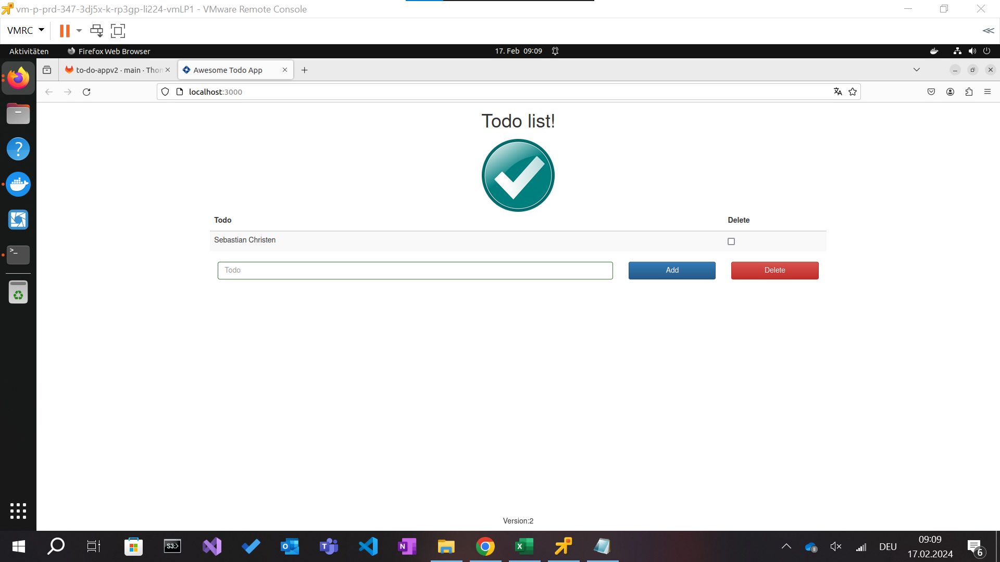

Screenshot der Images auf Git:
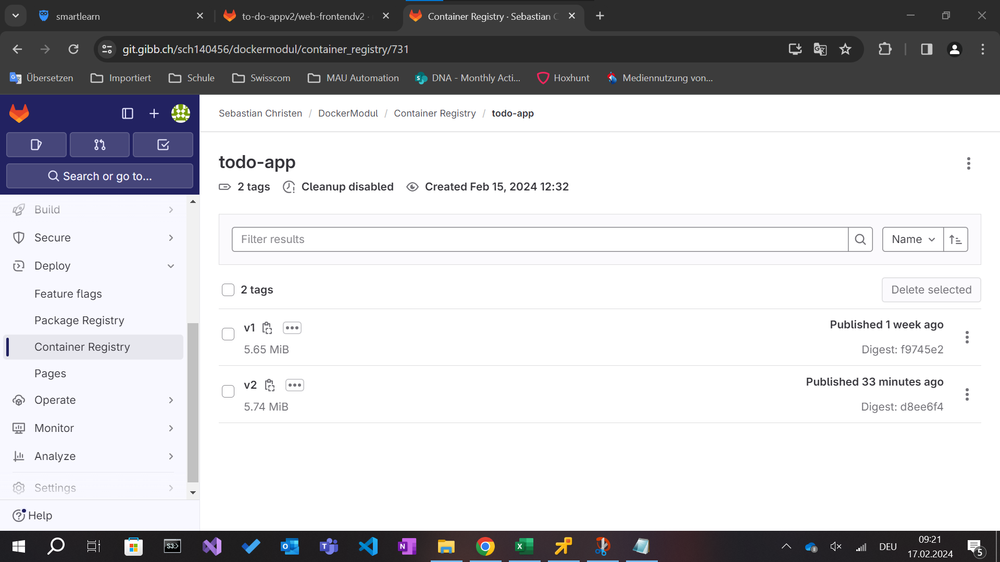

## Docker Compose

Docker Compose ist ein Tool, welches von Docker entwickelt wurde und dazu da ist, die Verwaltung von Docker-Containern zu vereinfachen. Mit Docker Compose kann man Image-Erstellung, Container-Starts und -Stops, das Beachten von Reihenfolgen, Links, Ports und Umgebungsvariablen automatisieren. Docker Compose verwendet eine YAML-Datei, in der die Konfiguration von der Container-Anwendung festgelegt wird. Mit einem einzigen Befehl kann man alle Dienste nach dieser Konfiguration erstellen und starten. Es erleichtert die Verwaltung von Docker-Anwendungen und automatisiert komplexe Abläufe.

### Vorgehen, Befehle und Compose-Datei

```bash
sudo apt update
sudo apt install docker-compose
nano docker-compose.yaml  # Die Datei erstellen, danach folgendes eingefügt:

    version: "3"
    services:
      todoapp:
        image: git-registry.gibb.ch/sch140456/dockermodul/todo-app:v2
        ports:
         - "3000"
        depends_on:
         - redis-master
         - redis-slave
      redis-slave:
        image: git-registry.gibb.ch/sch140456/dockermodul/redis-slave:v1
        depends_on:
         - redis-master
      redis-master:
        image: git-registry.gibb.ch/sch140456/dockermodul/redis-master:v1


# zum Schluss noch...
docker-compose -f docker-compose.yaml up -d

```

## Portainer

Portainer Screenshot:


### Vorgehen Portainer

I. Portainer gestartet

II. Beim "local" Environment auf "Live Connect" gedrückt

III. Bei "Stack" auf "add stack" gedrückt

IV. Dann habe ich diesen Code hier eingefügt:

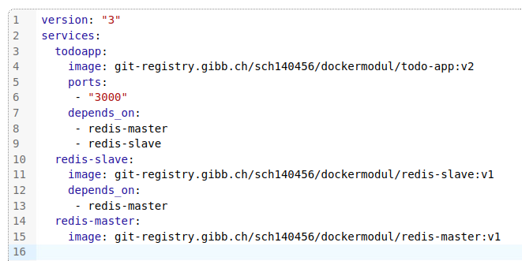

V. Auf "Deploy stack" gedrückt

VI. Dann sieht man die Container: 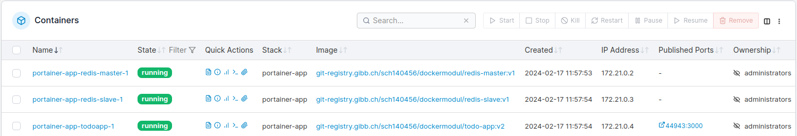

## Shop

I. Zuerst habe ich `sudo nano /etc/hosts` ausgeführt, um die Datei zu öffnen.

II. Dann auf der untersten Zeile `127.0.0.1    host.docker.internal` hinzugefügt.

III. Schliesslich habe ich `git clone https://git.gibb.ch/thomas.staub/microservices` ausgeführt, um es herunterzuladen.

IV. In den Ordner gehen: `cd microservices/Play.Infra/docker`.

V. `docker-compose -f docker-compose.yaml up -d` ausführen und einen Moment warten, bis es fertig ist.

VI. Dann im Browser auf http://host.docker.internal:5008/ gehen.

## Eigenes Projekt

Im Ordner "uebungsprojekt" befinden sich zwei Dateien: das Dockerfile, welches verwendet wurde, um das Image zu erstellen, welches sich nun auf git-registry.gibb.ch/sch140456/dockermodul/okon-website:v1 befindet. Die andere Datei ist das Docker-Compose-File. Im Docker-Compose wird das Image gepullt, und ein Container wird erstellt.

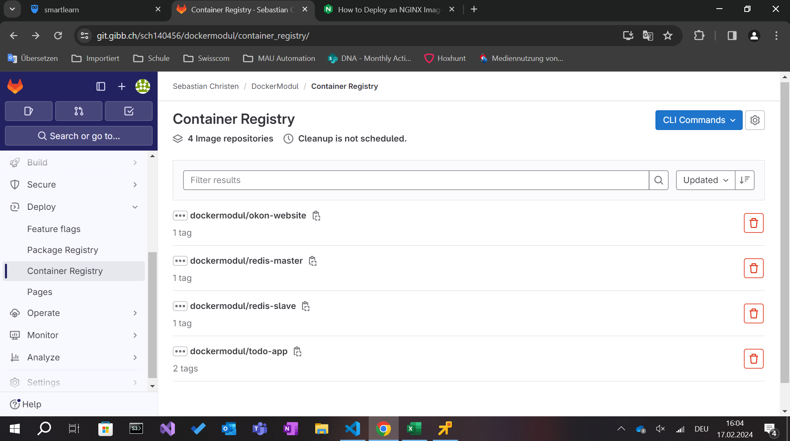

### Wie man das Projekt installiert

Laden Sie dieses GitHub-Repo herunter mit diesen Befehlen:

```bash
git clone https://github.com/Sebastianpkmn/M347-Dienst-mit-Container-anwenden.git
cd ./M347-Dienst-mit-Container-anwenden/uebungsprojekt
docker-compose -f ./docker-compose.yaml up -d
```

Danach sollten Sie auf Docker Desktop folgendes sehen. Sie können nun auf den Link bei "Ports" klicken:


# Kubernetes

## Was ist Kubernetes?

Kubernetes ist Orchestrator für die sogenannten Microservices. Es gehört zu einem grossen Bereich namens Cloud Native Computing und wird von der Cloud Native Computing Foundation unterstützt. Im Grund hilft Kubernetes dabei, Microservices zu organisieren, sie automatisch anzupassen und zu aktualisieren, ohne dass die Anwendung dabei ausfallen muss. Kubernetes kann folgendes Orchestrieren: Erstellen, Löschen, Neustart von Containern, Container-Startreihenfolge managen, Container-Neustart nach Absturz.

## Was sind Microservices?

Microservices sind eine moderne Art, Software-Anwendungen zu entwickeln und zu organisieren. Anstatt eine grosse Anwendung als ein monolithisches Ganzes zu erstellen, wird sie in kleinere, unabhängige Dienste oder "Microservices" aufgeteilt. Jeder Microservice erfüllt eine spezifische Funktion und kann eigenständig entwickelt, bereitgestellt und skaliert werden. Diese Unabhängigkeit ermöglicht eine flexiblere und schnellere Entwicklung, da Änderungen an einem Microservice keine Auswirkungen auf andere Teile der Anwendung haben. Microservices fördern auch eine bessere Skalierbarkeit, Wartbarkeit und fördern die kontinuierliche Bereitstellung von Software.

## Vergleich lightweight K8s Anwendungen

Alle diese Tools sind darauf ausgerichtet, Kubernetes in verschiedenen Umgebungen bereitzustellen und zu verwalten.

### Einfachheit

Minicube: Einfach zu installieren
MicroK8s: Speziell für Ubuntu
Docker for Windows: Einfach zu installieren und zu verwenden.
K3s: Es ist leichtgewichtig und einfach zu installieren.

### Ressourcenverbrauch

Minicube: Verbraucht etwas mehr Ressourcen als andere Tools
MicroK8s: Sehr ressourcenschonend
Docker for Windows: Mittlerer Ressourcenverbrauch
k3s: verbraucht minimal Ressourcen im Vergleich zu anderen Optionen.

### Anwendung

Minikube: Ideal für lokale Entwicklung und Tests, um Kubernetes-Cluster schnell zu starten.
MicroK8s: Kann für verschiedene Anwendungsfälle verwendet werden
Docker for Windows: Für Windows-Benutzer
k3s: Für IoT, aber auch für lokale Entwicklungszwecke geeignet.

## Kubernetes installation

I. Docker Desktop öffnen, da wir es schon haben

II. Auf den Käfer drücken, danach auf "Kubernetes" drücken

III. "Enable Kubernetes" aktivieren, indem man aufs Häkchen drückt

IV. Im Terminal dann `sudo snap install kubectl --classic`

V. Dann folgende Befehle ausführen, um es mit der Docker Desktop Instanz zu verknüpfen.

```bash
kubectl config get-contexts
kubectl config use-context docker-desktop
```

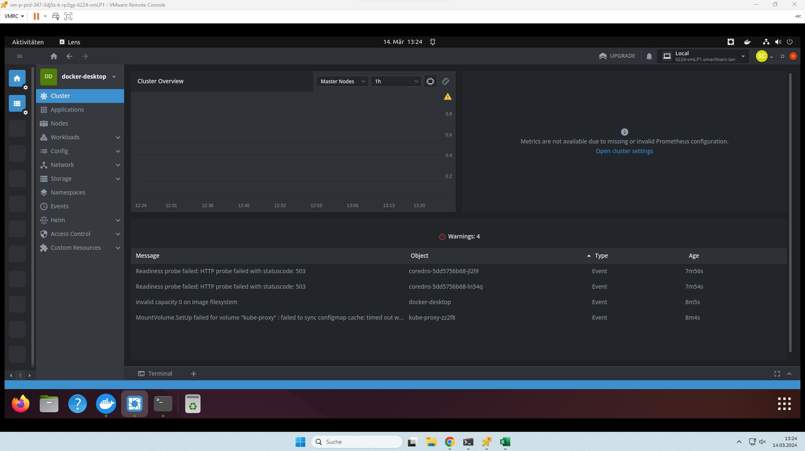

## Raft-Konsens-Algorithmus

Es gibt mehrere Nodes. Die Nodes sind "Follower".
Wenn einer dieser Nodes keinen "Leader" hat, meldet er sich zur Wahl.
Jetzt können die Follower abstimmen und wählen einen Node.
Wenn der Node gewählt wurde, übernimmt er die Verantwortung für die Koordination des Clusters. Er empfängt Anfragen von Clients, aktualisiert den gemeinsamen Zustand des Systems und koordiniert die Replikation von Daten über die Cluster-Nodes.

Der Grund, warum man eine ungerade Anzahl Server haben sollte, ist wegen dem Abstimmungsprozess.
Eine ungerade Anzahl führ dazu, dass es nicht zu einem Gleichstand kommt, da keine zwei Leader dieselbe Anzahl an Stimmen erhalten können.

## App

Wir laden uns das Git-Repo runter.
In diesem Repo hat es yaml-dateien, welche wir noch anpassen für unser image.
Es werden zwei controller erstellt: Einen für redis-master und den anderen für redis-slave
Die Pods sind im Namespace to-do-app.
Danach starten wir die Services.
Mit `kubectl -n to-do-app port-forward svc/todo-app-service 8080:80` kann dann die To-do-app gestartet werden.

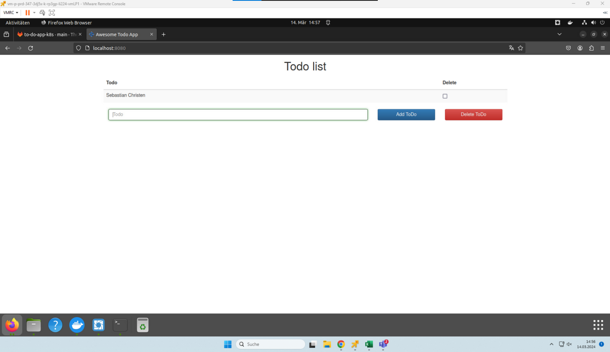

## Self Healing, Scale Down, Scale Up

### Self-Healing
Self-Healing bedeutet, dass Kubernetes automatisch neue Pods startet, wenn bestehende Pods ausfallen oder abstürzen. Auf diese Weise bleibt die Anwendung stabil und verfügbar, da sie sich selbst repariert, wenn etwas schief geht.

### Scale Up
Scale Up bedeutet, dass Kubernetes automatisch zusätzliche Pods startet, um mit steigender Nachfrage oder Last umzugehen. Dadurch kann die Anwendung mehr Arbeit gleichzeitig erledigen und flexibel auf Anforderungen reagieren.

### Scale Down
Scale Down bedeutet, dass Kubernetes automatisch überflüssige Pods entfernt, wenn die Nachfrage oder Last abnimmt. Dadurch werden Ressourcen freigegeben und Kosten gesenkt, während die Effizienz der Anwendung aufrechterhalten wird.

## Rolling Update
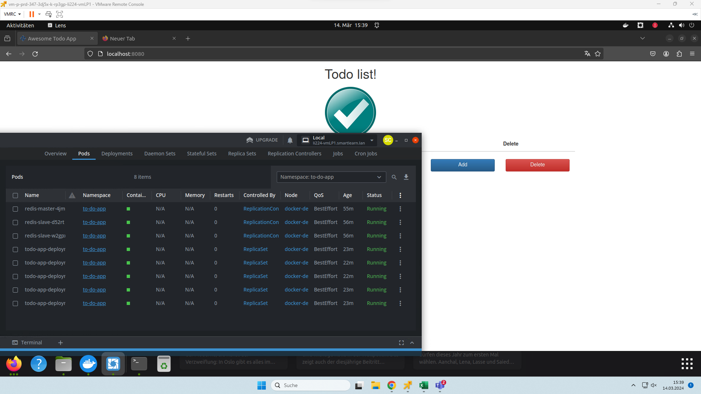

## Blue Green Deployment
Es gibt Umgebungen: Bei Blue/Green Deployment gibt es zwei identische Produktionsumgebungen, die gleichzeitig laufen. Die eine Umgebung ist die aktive Produktionsumgebung, und die andere für Updates und Tests.

- Wenn es eine neue Version einer Anwendung gibt, wird sie in der anderen Umgebung zunächst bereitgestellt, danach wird langsam von der einten zur anderen gewechselt.
- Da die Benutzer während des Deployments weiterhin auf die eine Umgebung zugreifen können, gibt es keine Unterbrechung der Dienste. Dies minimiert das Risiko von Ausfallzeiten oder Beeinträchtigungen für die Benutzer.
- Wenn es Probleme mit dem neuen Deployment gibt, kann das Rollback schnell durch Umschalten des Datenverkehrs auf die vorherige Umgebung erfolgen. Dadurch kann die Anwendung schnell wieder in einen stabilen Zustand versetzt werden.

## Cluster IP & Node IP

### Cluster IP 
Der Cluster-IP wird intern im Kubernetes-Cluster verwendet, um die Kommunikation zwischen verschiedenen Ressourcen innerhalb des Clusters zu ermöglichen. Er ist nur innerhalb des Clusters erreichbar und kann nicht von ausserhalb des Clusters angesprochen werden. Der Cluster IP wird verwendet, um den internen Datenverkehr zwischen den verschiedenen Teilen einer Anwendung zu steuern, z. B. zwischen verschiedenen Microservices.

### Node IP
Node IP ermöglicht den Zugriff auf einen Kubernetes-Service von außerhalb des Clusters. Wenn ein Service als NodePort deklariert wird, wird er auf der IP-Adresse jedes einzelnen Nodes im Kubernetes-Cluster verfügbar gemacht. Man kann auf den Service von außerhalb des Clusters zugreifen, indem man die IP-Adresse eines bestimmten Nodes und den entsprechenden Port im Browser oder in Anfragen angibt. Dies kann in Produktionsumgebungen verwendet werden, hat aber einige Einschränkungen.

## Auf App zugreiffen
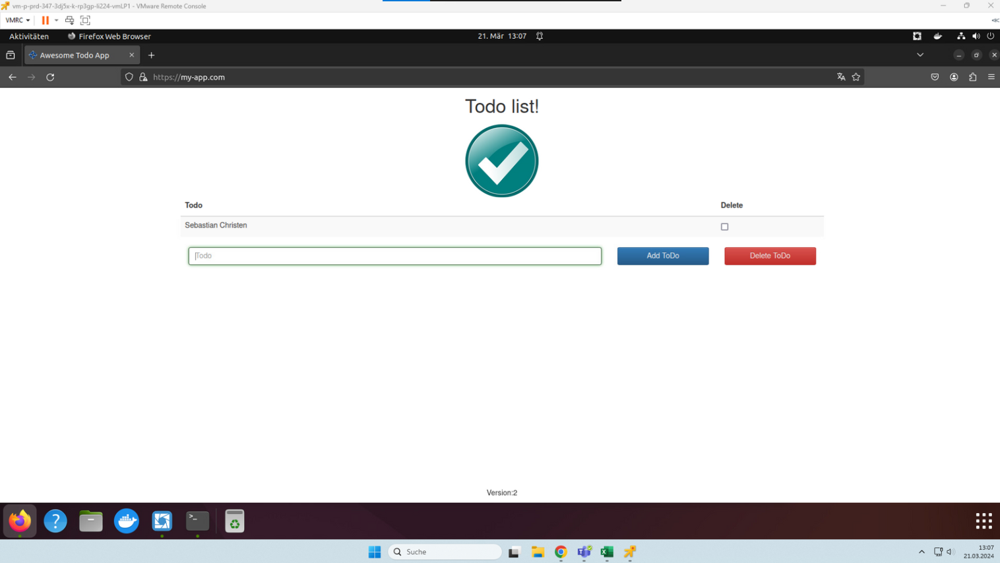

### Waum es mit my-app.com geht, aber mit localhost nicht
Weil Ingress

## Portainer auf Kubernetes 
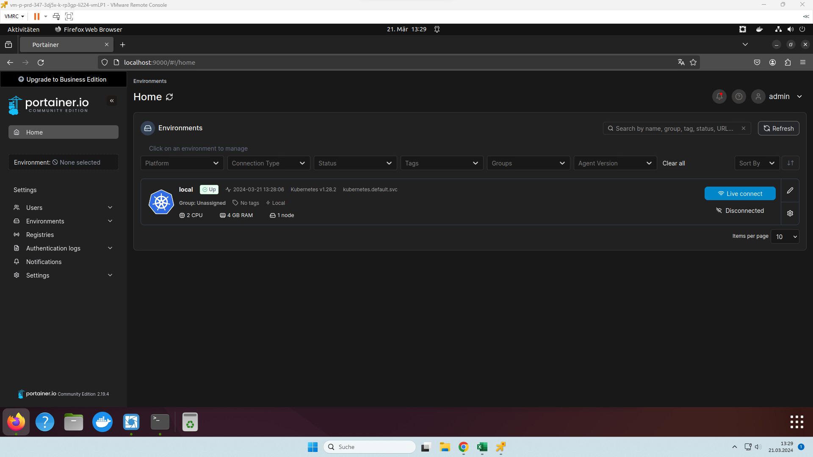

## Eigene Website auf K8s
[yaml-datei]
[commands]
[screenshot]

