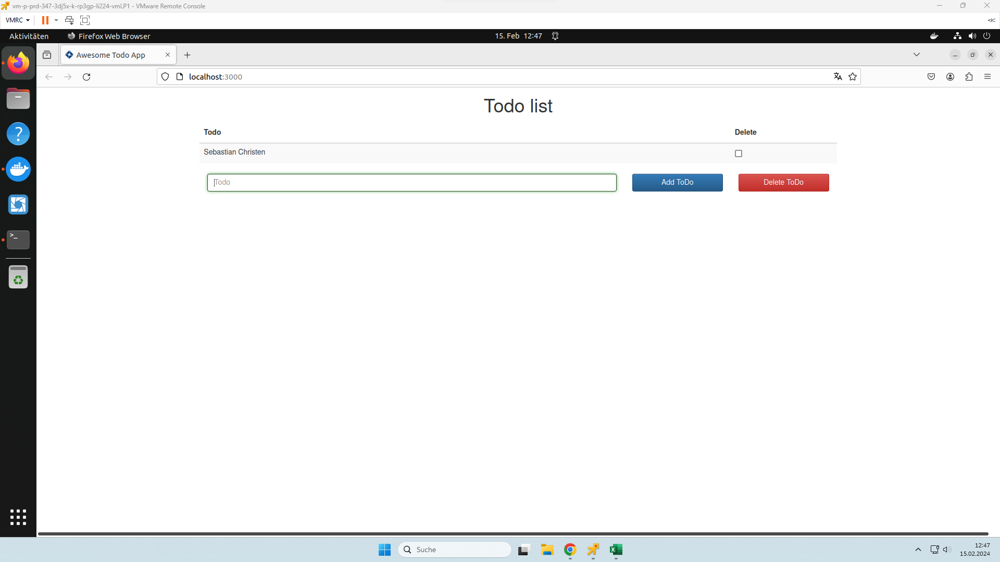
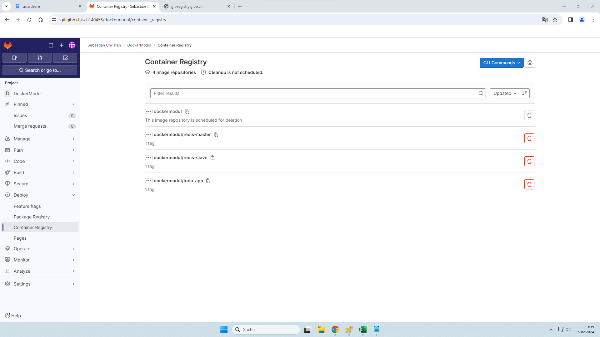
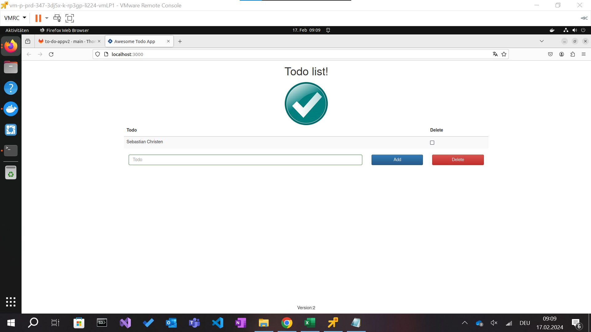
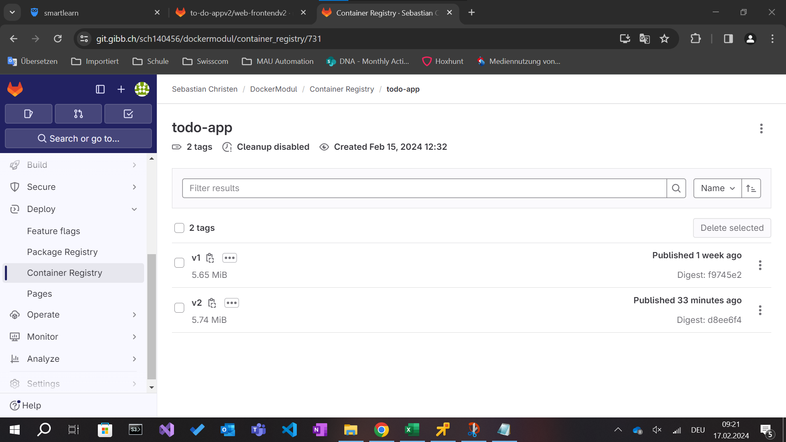
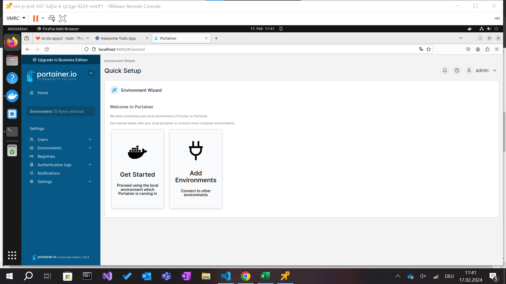
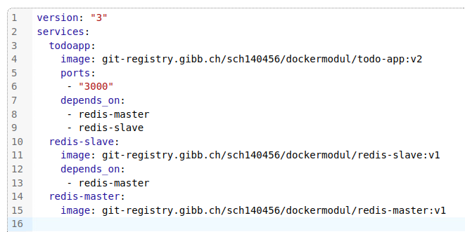
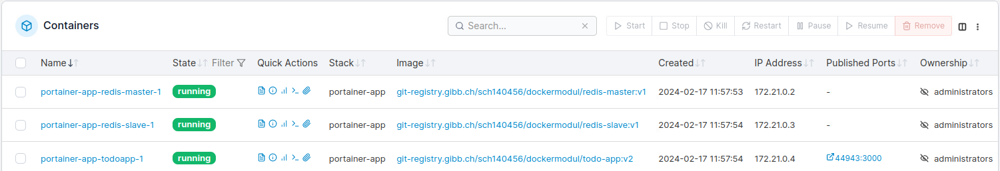

# Portfolio "Dienst mit Container anwenden"

Sebastian Christen, INF2022j
2024/02/01, Version Alpha00


## Was sind Container?
Ein Container kann man sich am besten so vorstellen, dass er wie eine vereinfachte VM (virtuelle Maschine) ist, welcher einen vom Benutzer bestimmten Prozess laufen lässt. Der Container ist dazu da, ein Docker-Image laufen zu lassen, und wärend der Laufzeit des Containers dieses Image verwendet. Ein Docker-Image, ähnlich wie bei einem VM-Abbild (Image), beinhaltet gewisse Applikationen, Skrips, etc., welche für den Prozess, den man auf Docker ausführen möchte, benötigt werden. Container eignen sich unter Anderem für Skalierbare Webapplikationen, welche je nach Auslastung mehr oder weniger Ressourcen benötigen.

## Was ist DevOps?
DevOps steht für Development und Operations, also Entwicklung und Betrieb. DevOps ist etwa im Jahr 2007 entstanden, aus dem Grund das Entwickler und IT-Experten besorgt darüber waren, wie traditionelle Softwareentwicklung und IT-Betrieb getrennt voneinander abliefen. DevOps ermöglicht es, die Zusammenarbeit zwischen Entwicklern und IT-Teams zu verbessern und Prozesse zu automatisieren. Ein DevOps-Team besteht aus Entwicklern und IT-Experten, die solange zusammenarbeiten, solange die Entwickelte Applikation verwendet wird.

## Unterschied Virtualisierung und Containerisierung
Der Unterschied zwischen Virtualisierung und Containerisierung ist, wie sie mit der Hardware und dem Betriebssystem umgehen. Bei VMs wird das OS virtuell nachgebildet, was dazu führt, dass VMs ziemlich gross sind. Container benutzen deutlich weniger Ressourcen, da sie sich das Betriebssystem teilen. Deshalb sind Containers kleiner und effizienter. Docker läuft nur auf Linux, weil es stark vom Host-Betriebssystem abhängt.
Zusammenfassend sind Containers viel leichter und auch schneller als VMs.

## Unterschied Image und Container
Container sind bewegend, wärend images ein statisches abbild eines systems zu einem gewissen zeitpunk ist. [TODO]

## Zusammenfassung der Wichtigsten Befehle und ihre funktion (Diese wird laufend ergänzt)
| Befehl                                | Funktion          |
| ------------------------------------- | ------------------ |
| `ls`                                    | gibt den Inhalt im Ordner aus |
| `docker tag <ersterName> <zweiterName>` | Umbenennen        |
| `docker login` | sich einloggen |
| `docker pull <imageName>`| ladet das Image imageName herunter |
| `docker images -a` | zeige alle images an |
#Hier eine Zusammenfassung der bis jetzt eingesetzten Befehle. 
docker run --name some-nginx -d -p 8080:80 nginx  #erzeugt einen neuen Container im Hintergrund und verbindet die Ports
docker run --name some-nginx -d --rm -p 8080:80 nginx #erzeugt einen neuen Container und löscht diesen nach beenden gleich wieder
docker stop some-nginx  # Stopt ein Container durch herunterfahren
docker kill some-nginx  # Killt ein Container 
docker rm some-ngnix # löscht ein Container vom System
docker start some-nginx   #startet ein bestehender Container
docker ps -a # Zeigt mir welche Container auf dem System vorhanden sind. 
docker images # Zeigt mir welche Images auf dem System vorhanden sind.
docker kill some-nginx  # Killt ein Container 
docker rm some-ngnix # löscht ein Container vom System
docker rmi ngnix # löscht ein Image vom System
docker system prune -a --volumes  #Löscht alle Conatiner, Images, Volumes vom System. 
Delete a container (if it is not running):

docker rm [CONTAINER]

Update the configuration of one or more containers:

docker update [CONTAINER]

Start a container:

docker start [CONTAINER]

Stop a running container:

docker stop [CONTAINER]

Stop a running container and start it up again:

docker restart [CONTAINER]

Pause processes in a running container:

docker pause [CONTAINER]

Unpause processes in a running container:

docker unpause [CONTAINER]

Block a container until others stop (after which it prints their exit codes):

docker wait [CONTAINER]

Kill a container by sending a SIGKILL to a running container:

docker kill [CONTAINER]

Attach local standard input, output, and error streams to a running container:

docker attach [CONTAINER]

 [TODO]


## Onlyoffice


##  Todo-app V1

Screenshot des Frontend für Version 1:



Screenshot der Images auf git:



## Aufgabe 1 bei "Ein Image Pushen", Befehle

```docker login``` --> einloggen
``docker image tag todo-app:v1 git-registry.gibb.ch/sch140456/dockermodul/todo-app:v1`` --> das image umbenennen
``docker push git-registry.gibb.ch/sch140456/dockermodul/todo-app:v1``  --> das image hochladen


##  Todo-app V2

Screenshot des Frontend für Version 2:



Screenshot der Images auf git:



## Docker Compose
Docker Compose ist ein Tool, welches von Docker entwickelt wurde und dazu da ist, die Verwaltung von Docker containern zu vereinfachen. Mit docker compose kann man Image-Erstellung, Container-Starts und -Stops, das Beachten von Reihenfolgen, Links, Ports und Umgebungsvariablen automatisieren. Docker Compose verwendet eine YAML-Datei, in der die Konfiguration von den Container-Anwendung festgelegt wird. Mit einem einzigen Befehl kann man alle Dienste nach dieser Konfiguration erstellen und starten. Es erleichtert die Verwaltung von Docker-Anwendungen und automatisiert komplexe Abläufe.

## Vorgehen, Befehle und Compose Datei

sudo apt update
sudo apt install docker-compose
[TODO]

## Portainer

Portainer screenshot:



### Vorgehen Portainer

I. Portainer gestartet

II. Beim "local" Environment auf "Live Connect" gedrückt

III. Bei "Stack" auf "add stack" gedrückt

IV. eingefügt: 

V. Auf "Deploy stack" gedrückt

VI. Dann sieht man die Container: 

## Shop

zuerst habe ich ``sudo nano /etc/hosts`` gemacht, dann auf der untersten zeile 127.0.0.1    host.docker.internal hinzugefügt
``git clone https://git.gibb.ch/thomas.staub/microservices`` ausgeführt, um es herunterzuladen
in den ordner gehen: ``cd microservices/Play.Infra/docker``
``docker-compose -f docker-compose.yaml up -d`` ausführen und ein kehrchen warten, bis es fertig ist
dann im browser auf http://host.docker.internal:5008/ gehen


## Eigenes Projekt

Im Ordner "uebungsprojekt" befinden sich zwei dateien: das Dockerfile, welches verwendet wurde, um das Image zu erstellen, welches sich nun auf git-registry.gibb.ch/sch140456/dockermodul/okon-website:v1 befindet.
Die andere datei ist das docker-compose-file. im docker-compose wird das image gepullt, und ein container wird erstellt.

### Wie man das Projekt installiert wird

laden sie dieses github-repo herunter mit dem befehl

``git clone https://github.com/Sebastianpkmn/M347-Dienst-mit-Container-anwenden.git``

dann wechseln sie in den "uebungsprojekt"-order mit ``cd ./M347-Dienst-mit-Container-anwenden/uebungsprojekt``

danach führen sie den befehl hier aus: ```docker-compose -f ./docker-compose.yaml up -d```


